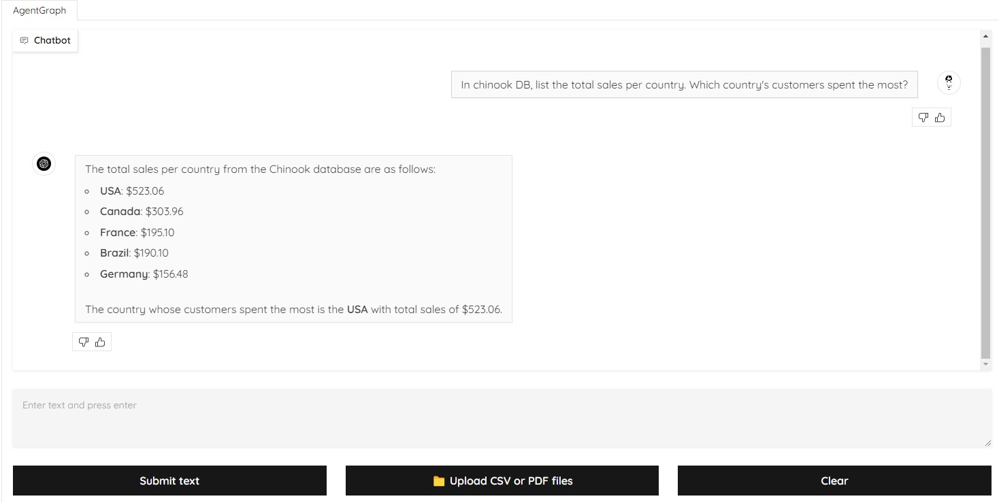

# Agentic System with LLMs and SQL Agents

## Overview
This project demonstrates the development of an agent-based system using Large Language Models (LLMs) that can interact with multiple databases and utilize various tools. The system efficiently queries large databases through the integration of SQL agents. The project leverages key frameworks such as OpenAI, LangChain, LangGraph, LangSmith, and Gradio to create an end-to-end chatbot designed to perform specific tasks. LangSmith is used to monitor and evaluate the performance of the agents throughout the process.

## Key Features
- **SQL Agent Integration**: Efficient querying of large databases using SQL agents.
- **LLM-based Agent System**: Build a system that utilizes Large Language Models to interact with various tools and databases.
- **End-to-End Chatbot**: A fully functional chatbot that performs a range of tasks, powered by LangChain and other supporting frameworks.
- **Performance Monitoring**: LangSmith is used to track and assess agent performance during interactions.

## Technologies Used
- **OpenAI**: For large language model integration.
- **LangChain**: To chain together various LLMs and other tools in a coherent pipeline.
- **LangGraph**: For building agent workflows and pipelines.
- **LangSmith**: For monitoring and evaluating agent performance.
- **Gradio**: For building the user interface for interaction with the chatbot.

## Setup Instructions

### Prerequisites
Before setting up the project, ensure you have the following:
- Python 3.x or later
- Git
- Access to OpenAI API for LLM integration

### User Interface

